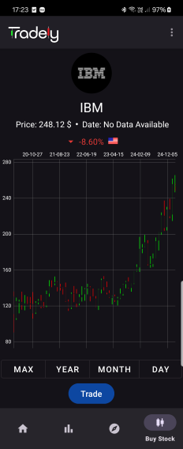

Final Project of Afeka's `Mobile Apps - 25A10357` Class.

## How to Run

> To use this app (with it's full feature set), you'll need a alphavantage api.
> If you don't have one, you can still run the app without it. just create a fake file instead.

- Save your `token` in the project root directory under `local.env`:

  ```properties
  STOCK_API_KEY=<Your Token>
  ```

# Overview

Tardely is a stock market simulator built using `Kotlin 2.1.0`, designed for Android devices.

## App Flow

[//]: # (![Overview]&#40;./docs/app_overview.png&#41;)

### 1. Home Screen (Profile)


- **Profile Card** - displays the profile info and lets you edit your own profile 
- **Watchlist & Owned Stocks** - Uses a viewpager to display the user's `watchlist` and `owned stocks` updates using `ProfileViewModel`

### 3. Leaderboard


- Creates the leaderboard using `RecyclerView` and `LeaderboardAdapter` to display the top players
- Updates the leaderboard using `LeaderboardViewModel` and `Profile Manager` with read-time data from `Firebase Firestore` with the Observer pattern.
- Clicking on a user will navigate to their profile.
- **follow** - follows the profile to let you see their updates. (A follow tab maybe in the future)

### 4. Explore Stocks
|  |  |
| ---------------------------------------------- |----------------------------------------|

- Creates the stock list using `RecyclerView` and `StockAdapter` to display the stocks that are currently available to simulate.
- Updates the stock list using `StockViewModel` and `StockManager` with read-time data from `Firebase Realtime` using the Observer pattern.
- Clicking on a stock will navigate to the stock details.
- **Search** - Uses `SearchView` to filter the stocks by name.
- **Deep Search** - When no stock is found in the search, the app will try to find the stock in the `AlphaVantage API Key` and add it to the list. (Photo to the right).
- **Watchlist** - Adds the stock to the profile's watchlist using `ProfileManager`.

### 4. Stock Details



- Uses `StockViewModel` to display the details of the chosen stock.
- **Buy/Sell** - Uses `ProfileManger` to buy/sell stocks.
- **Add to Watchlist** - Uses `ProfileManger` to add/remove stocks from the watchlist.
- **Interactive Chart** - Uses `MPAndroidChart` to display the stock's price history in the form of a `candlestick chart`.

## Authors

- [@lordYorden](https://github.com/lordYorden)
